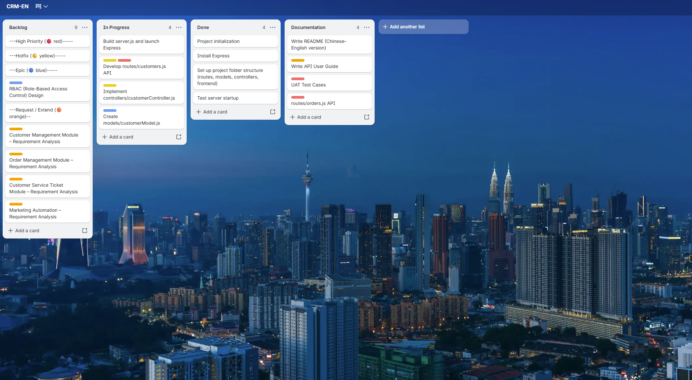

# CRM System – Project Management Showcase

### This project demonstrates a Customer Relationship Management system designed as a project management showcase. It highlights the ability to plan, track, and deliver tasks across both application and infrastructure layers.
---
## Features
- Customer Management: Add, update, and track customer records  
- Order Processing: Create and manage customer orders  
- Ticket Tracking: Submit and resolve support tickets  
- Dashboard: Simple UI for operational tasks  

## Tech Stack
- Frontend: React, HTML, CSS  
- Backend: Node.js + Express RESTful APIs  
- Database: SQLite (`crm.sqlite`)  
- Tools: VS Code, GitHub, Trello (for project tracking)  
  
## Project Management Approach
- Planning Tool: Trello board with Backlog / In Progress / Done  
- Labels: Priority, Hotfix, Requirement/Extend, Epic 
- Workflow: Requirement analysis → API development → Testing → Documentation

## Trello Board – Project Management Workflow
*(CRM-EN Board showing backlog, progress, and documentation tasks)*  


## Infrastructure Extension (Conceptual Layer)
To simulate enterprise deployment, the CRM project is extended with a conceptual infrastructure layer:
- Firewall configuration with public IP for secure remote access  
- Switch/router setup for internal/external connectivity  
- Gateway management for traffic routing  
- Monitoring tools (Cacti/SNMP/Prometheus) for performance tracking  
- SSL/TLS for secure communication  


## Project Structure
- `controllers/` – Business logic and request handling  
- `models/` – Database schema and ORM definitions  
- `routes/` – RESTful API endpoints  
- `frontend/` – UI components and dashboard  
- `utils/` – Helper functions  
- `data/` – Sample data and configuration  
- `crm-nodejs-lite/` – Lightweight version of large/hidden files (e.g., node_modules, environment files)  
- `server.js` – Entry point for backend service  

> `node_modules` and hidden files are excluded from GitHub for size and security reasons.  
> Dependencies can be restored using `npm install`.

---

## How to Run

### 1. Clone the repository
```bash
git clone https://github.com/hlr95035339/PM_CRM-INFRA.git
cd PM_CRM-INFRA
2. Install dependencies

## Demonstrated Skills
- Scrum-style project planning and tracking  
- Backend development with Node.js and Express  
- @@@UI/UX design for operational dashboards  
- Infrastructure awareness (conceptual deployment, monitoring, firewall)  
-@@@@ Bilingual documentation and communication  

## Usage
1. Clone the repository  
   ```bash
   git clone https://github.com/yourusername/crm-project.git
